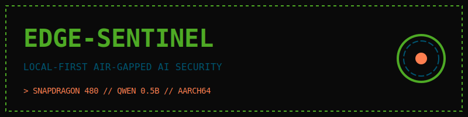

# 🛡️ Edge-Sentinel-Mobile

**Autonomous, Air-Gapped AI Security for Constrained Edge Devices.**

Edge-Sentinel-Mobile transforms your Android device into a private security node. It runs real-time telemetry and LLM analysis entirely on-device. No cloud. No APIs. No leaks.

## 🏗️ Architecture
- **Backend:** FastAPI with Asynchronous WebSockets.
- **AI Engine:** llama.cpp (compiled natively for ARM64/NEON).
- **Inference:** Qwen-1.5-0.5B (Quantized Q4_K_M).

## 🚀 Quick Start
1. `./install.sh`
2. `./start.sh`
3. View at `http://127.0.0.1:8001`
